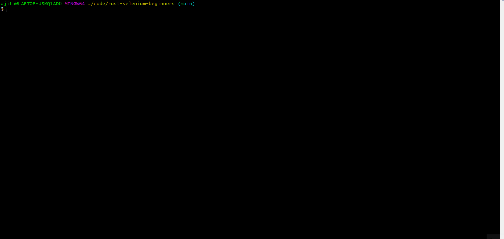

# Learn Selenium using examples for beginners
Selenium lets you control the browser through a script. Selenium lets you interact with browsers in a manner similar to real users interacting with browsers. We present small code samples that help you learn Selenium from scratch using Rust with https://qxf2.com/Selenium-tutorial-main. These are example code for some of the most commonly performed actions on a webpage like navigating to a URL, fill in the text, click buttons, hover over elements, choose drop downs, validate text, etc. UI automation is (thankfully) not needed as much in the Rust ecosystem. However, we do foresee it being a tiny portion of our testing strategy.

**Disclaimer:** This code is aimed at Selenium BEGINNERS with Rust. There are several bad practices here like hardcoding URL's, values, using sleep. Qxf2 engineers doesn't write such rust code at clients.

## Download the driver
- Download Geckodriver (https://github.com/mozilla/geckodriver/releases) and add it to your PATH environment variable
- Download Chromedriver (https://sites.google.com/chromium.org/driver/) and add it to your PATH environment variable

## Run the Tests

  **Note1:** The folder structure contains tests and all tests are present within it because these are integration tests.
  **Note2:** When you run the tests for first time, it will take sometime(~5min) to build and run it. From next time, tests would run in a jiffy.
  **Note3:** Before running the tests, navigate to the source directory containing the .toml file
  
- Open a terminal and run the driver with the following command

        chromedriver
        
- Open another terminal and run the following to run individual test
        
        cargo test --test 11_consolidated_test
        
- To run all the tests sequentially, run the following
        
        cargo test  

We have found that a lot of Rust codes written online is for folks who knows Rust well. Hence, the code provided doesn't always compile or they just provide code snippets. We thought, for someone like a Rust beginner, this would be helpful. 
